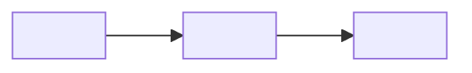

# <!-- 論文タイトル（例: Attention Is All You Need）-->

**出典:** <!-- 著者名, *論文タイトル*, 会議名/ジャーナル名 年（例: Vaswani et al., *Attention Is All You Need*, NeurIPS 2017）-->
**担当:** （担当者名）
**日付:** <!-- YYYY-MM-DD -->

---

## Abstract / 概要

<!-- 原文Abstractを元に、日本語で3〜5文の概要を書く。
     「本論文では〜を提案する。〜という問題に対し〜というアプローチを取る。
      実験により〜が示された。」-->

---

## 背景・動機（なぜこの研究が必要か）

<!-- 先行研究の何が問題だったかを3〜5文で説明する。
     単に「〜の問題がある」ではなく、「〜の問題があり、その結果〜という限界がある」という形で。 -->

| 先行手法 | 問題点 |
|---|---|
| <!-- 手法A --> | <!-- 問題点 --> |
| <!-- 手法B --> | <!-- 問題点 --> |



---

## 提案手法（Method）

### 全体像

<!-- 提案手法の概要を2〜4文で説明する。 -->

$$<!-- 中心となる数式（なければ省略） -->$$

- $<!-- 変数 -->$：<!-- 意味 -->

```mermaid
<!-- アーキテクチャ・システム構成・データフローなどを図示 -->
graph TB
    A["<!-- 入力 -->"] --> B["<!-- 処理1 -->"]
    B --> C["<!-- 処理2 -->"]
    C --> D["<!-- 出力 -->"]
```

### <!-- 重要なコンポーネント1 -->

<!-- 各コンポーネントの説明 -->

!!! note "<!-- キーアイデア -->"
    <!-- 手法の核心となるアイデアを1〜3文で -->

### <!-- 重要なコンポーネント2（必要に応じて追加）-->

<!-- 説明 -->

!!! success "<!-- 先行手法との違い -->"
    <!-- 何が新しいか・何が改善されているか -->

---

## 実験・結果（Experiments & Results）

### 実験設定

| 項目 | 内容 |
|---|---|
| データセット | <!-- ... --> |
| ベースライン | <!-- ... --> |
| 評価指標 | <!-- ... --> |

### 主要結果

<!-- 定量評価の表 -->

| モデル | <!-- 指標1 --> | <!-- 指標2 --> |
|---|---|---|
| <!-- ベースライン1 --> | <!-- ... --> | <!-- ... --> |
| <!-- ベースライン2 --> | <!-- ... --> | <!-- ... --> |
| **<!-- 提案手法 -->** | **<!-- ... -->** | **<!-- ... -->** |

<!-- 定性的評価・可視化があれば記述 -->

!!! success "<!-- 主要な発見 -->"
    <!-- 何がどのくらい改善されたか。数値を含めて具体的に。 -->

---

## 考察・限界（Discussion & Limitations）

<!-- なぜ提案手法が効果的か（メカニズムの考察）-->

!!! warning "<!-- 限界 -->"
    <!-- 手法の限界・今後の課題・適用できないケース -->

---

## 結論

<!-- 本論文の貢献を箇条書きで整理 -->

| 貢献 | 内容 |
|---|---|
| <!-- 貢献1 --> | <!-- ... --> |
| <!-- 貢献2 --> | <!-- ... --> |

**まとめ：** <!-- 1〜2文で論文全体の結論 -->

---

## 発表者の所感・議論点

- <!-- 面白いと思った点・驚いた発見 -->
- <!-- 疑問点・不明点 -->
- <!-- 自分たちの研究・実験への応用可能性 -->
- <!-- 今後試してみたい実験・発展的考察 -->
