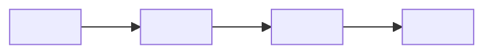

# <!-- 節タイトル（例: 6.3 深層ネットワーク）-->

**出典:** <!-- 著者情報（例: C. M. Bishop, H. Bishop, *Deep Learning*, Springer 2024, §6.3）-->
**日付:** <!-- YYYY-MM-DD -->

---

## 概要

<!-- 節全体が何を主張しているかを2〜4文で端的に述べる。
     前の節との連続性・この節の位置づけを含める。
     例: 「前節では二層ネットワークが理論上万能であることを示した。本節では〜」 -->

---

## サブセクション一覧

| サブセクション | タイトル | 担当 | 記事 |
|---|---|---|---|
| <!-- 6.x.1 --> | <!-- タイトル --> | <!-- 担当者名または（担当者名） --> | 準備中 |
| <!-- 6.x.2 --> | <!-- タイトル --> | <!-- 担当者名または（担当者名） --> | 準備中 |
| <!-- 6.x.3 --> | <!-- タイトル --> | <!-- 担当者名または（担当者名） --> | 準備中 |
| <!-- 6.x.4 --> | <!-- タイトル --> | <!-- 担当者名または（担当者名） --> | 準備中 |

<!-- 記事リンクは Mode 2 で各担当者が記事を追加した際に [詳細](slug.md) に更新される -->

---

## 全体の流れ

<!-- この節が扱うトピック群の論理的な流れを2〜4文で説明する。
     「まず〜を示し、次に〜を導入する。最後に〜でまとめる。」のような形で。 -->

<!-- 必要に応じて、節全体の見取り図を補助する画像スロットを次行に置く。
     例: image-slot id は section-overview-intuition のようにする。 -->

---

## まとめ

| 節 | テーマ | キーメッセージ |
|---|---|---|
| <!-- 6.x.1 --> | <!-- テーマ --> | <!-- 1行で要点 --> |
| <!-- 6.x.2 --> | <!-- テーマ --> | <!-- 1行で要点 --> |
| <!-- 6.x.3 --> | <!-- テーマ --> | <!-- 1行で要点 --> |
| <!-- 6.x.4 --> | <!-- テーマ --> | <!-- 1行で要点 --> |

**結論：** <!-- 節全体を1〜2文で締める -->

---

## 感想・議論

- <!-- この節全体に関わる疑問点・発展的考察 -->
- <!-- 次の節との接続 -->
